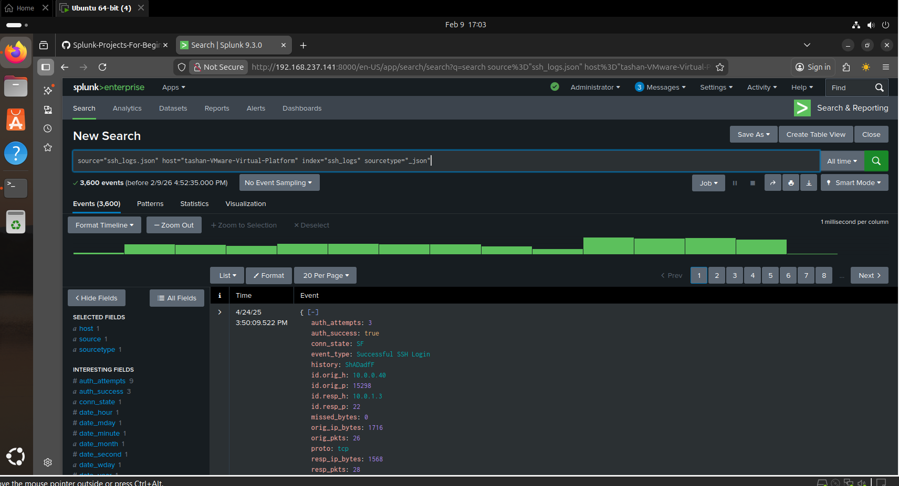

# HOME-LAB-SETUP
## INTRODUCTION
In this lab, Splunk Enterprise was installed and configured on an Ubuntu virtual machine to perform security log analysis. SSH log data was uploaded into Splunk and analyzed to identify source and destination IP activity, authentication attempts, and failed login patterns. Custom fields were extracted to improve visibility and investigation efficiency.

This exercise demonstrates practical SIEM skills including log ingestion, field extraction, and threat detection.
## Objectives

Install and configure Splunk Enterprise on an Ubuntu machine

Upload and index SSH log files into the Splunk environment

Perform log searching and filtering using Splunk Processing Language (SPL)

Identify and analyze source IP and destination IP information

Detect and quantify failed SSH login attempts

Extract and create custom fields (e.g., source_ip, destination_ip)

Gain hands-on experience with log analysis and SIEM workflows

Understand how centralized logging helps detect suspicious authentication activity
## SSH LOG ANANLYSIS
step-1 : Installed and configured Splunk on the Ubuntu machine

step-2 : Uploaded SSH log file through Settings → Add Data → Upload

step-3 : Indexed the logs for search and analysis

step-4 : Used SPL queries to explore log contents

step-5 : Extracted fields such as:

Source IP address

Destination IP address

Login status

Identified:

Most frequent failed login attempts

Suspicious IP activity

Authentication patterns

